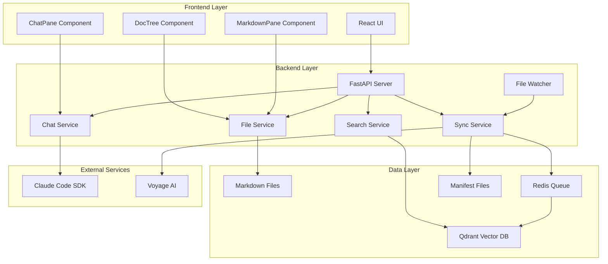
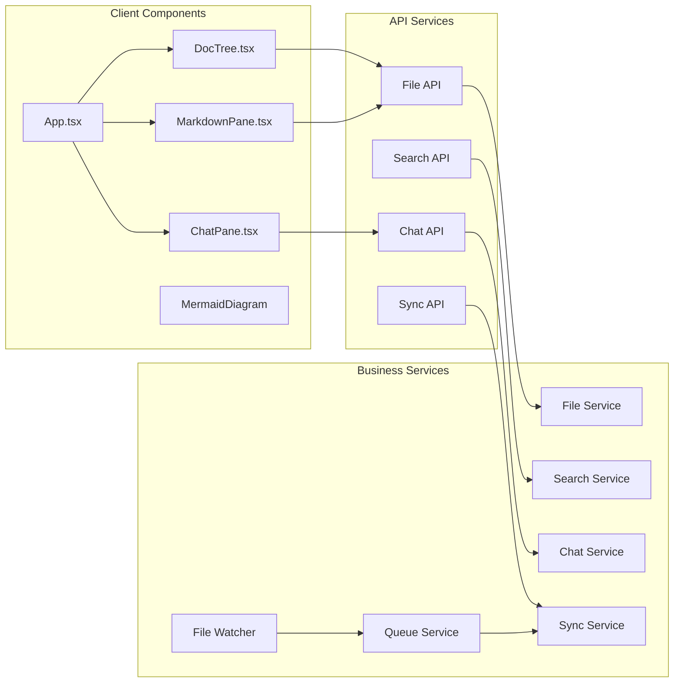
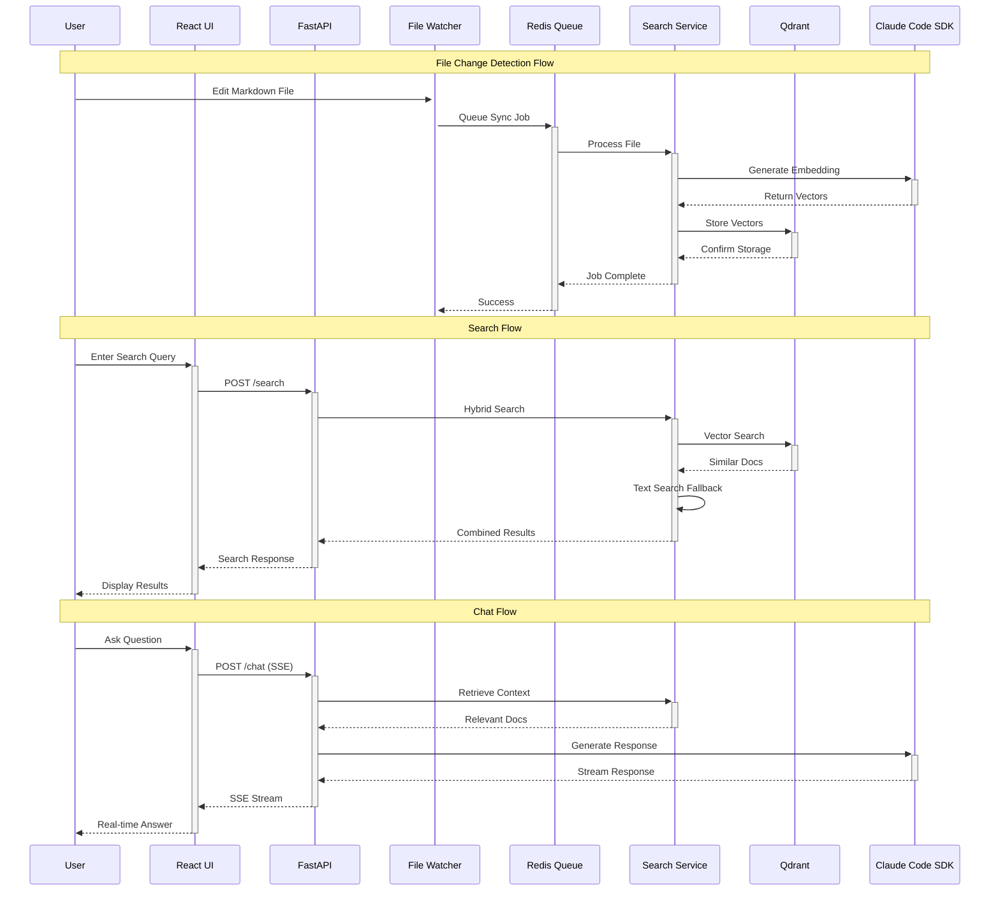
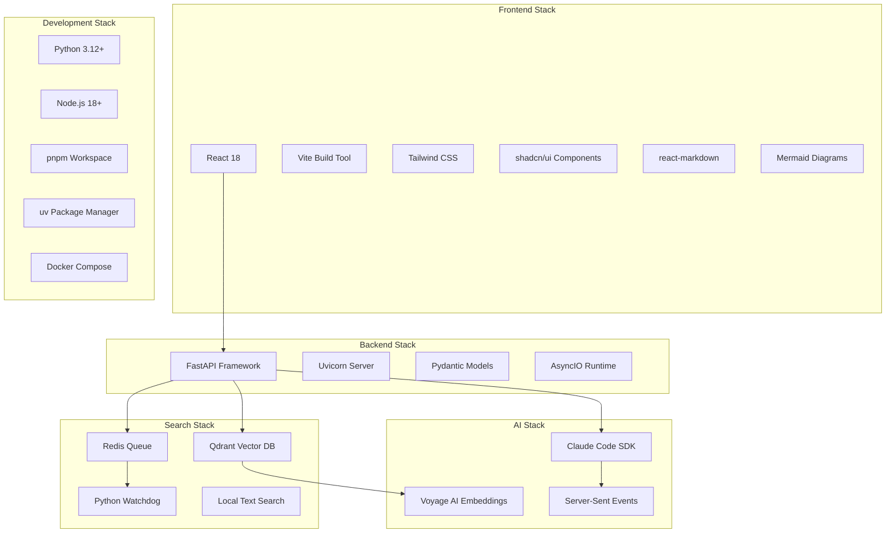
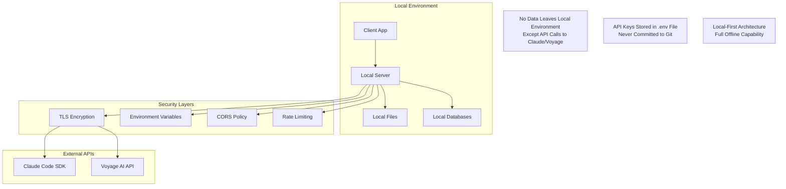
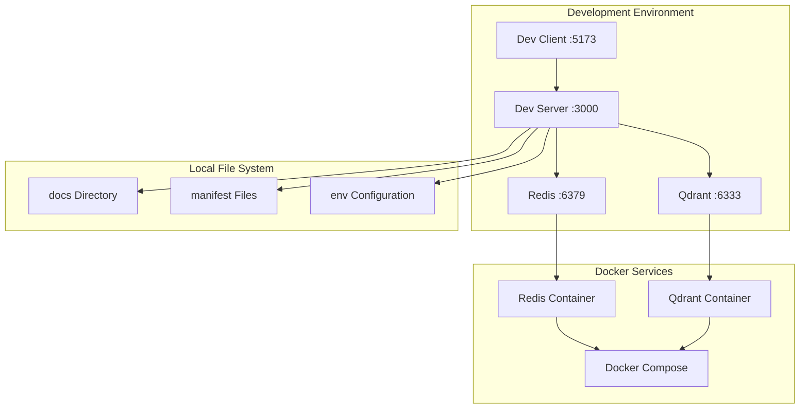

# System Architecture

## Overview

The Local DocSearch & Chat Assistant follows a modern three-tier architecture with real-time synchronization and hybrid search capabilities.

## High-Level Architecture

## Component Architecture

## Data Flow Architecture

## Technology Stack Architecture

## Security Architecture

## Deployment Architecture

## Key Design Patterns

### 1. Event-Driven Architecture
- File system events trigger sync jobs
- Queue-based processing with retry logic
- Real-time UI updates via SSE

### 2. Hybrid Search Pattern
- Vector search for semantic similarity
- Text search for exact matches
- Intelligent fallback mechanisms

### 3. Component-Based UI
- Resizable pane layout
- Independent component state
- Shared service layer

### 4. Service Layer Pattern
- Clear separation of concerns
- Dependency injection
- Mock-friendly testing

### 5. Local-First Design
- Offline capability
- Local data storage
- Minimal external dependencies