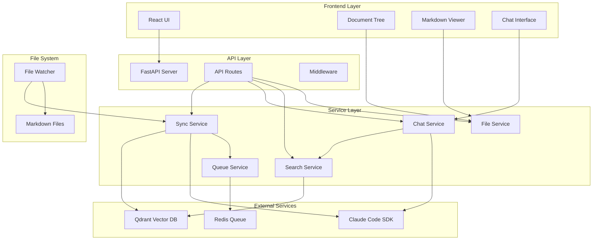
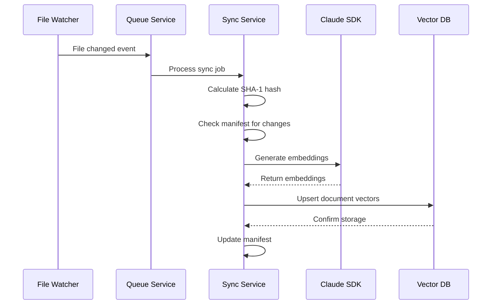
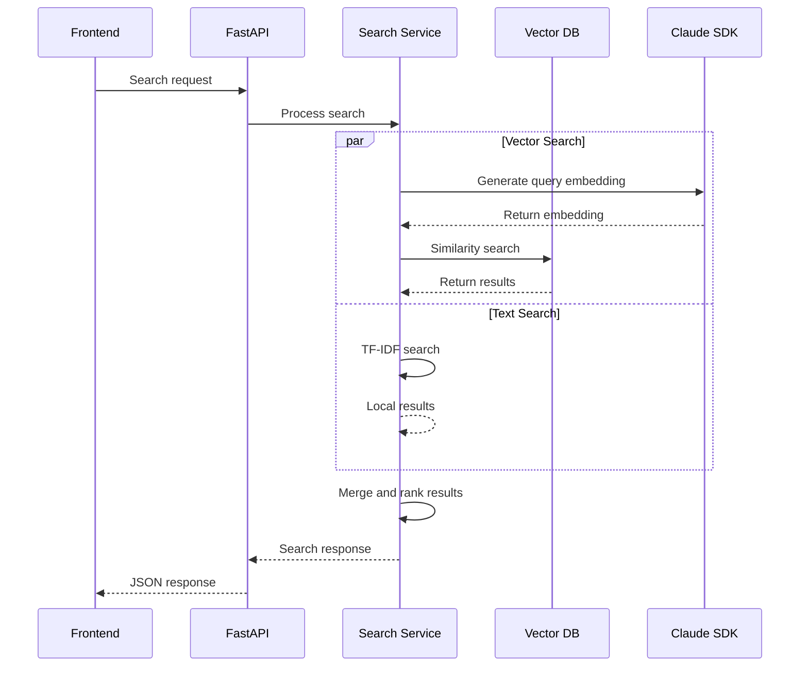
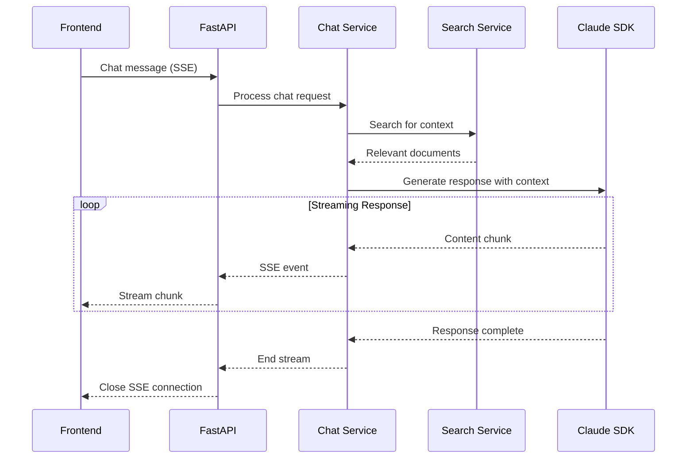

# System Architecture Overview

This document provides a comprehensive overview of the Local DocSearch & Chat Assistant system architecture, including component interactions, data flows, and design decisions.

## High-Level Architecture

## Component Overview

### Frontend Components

#### React Application
- **Technology**: React 18 + TypeScript + Vite
- **UI Framework**: shadcn/ui + Tailwind CSS
- **State Management**: React Hooks + Context API
- **Build Tool**: Vite for fast development and optimized builds

#### Three-Pane Layout
1. **Document Tree (Left)**: File system navigation
2. **Markdown Viewer (Center)**: Document content display
3. **Chat Interface (Right)**: AI-powered Q&A

### Backend Services

#### FastAPI Application
- **Framework**: FastAPI with async/await support
- **Runtime**: Python 3.12 + uvicorn ASGI server
- **Package Management**: uv for dependency management
- **Configuration**: Pydantic-based settings management

#### Core Services

##### File Service
- **Purpose**: File system operations and metadata management
- **Responsibilities**:
  - Directory traversal and file listing
  - File content reading and metadata extraction
  - Frontmatter parsing for Markdown files
  - File permissions and security validation

##### Search Service
- **Purpose**: Hybrid search implementation
- **Components**:
  - Text-based search with TF-IDF scoring
  - Vector search using Claude Code SDK embeddings
  - Intelligent fallback mechanisms
  - Result ranking and snippet generation

##### Chat Service
- **Purpose**: AI-powered conversational interface
- **Features**:
  - RAG (Retrieval-Augmented Generation)
  - Context extraction from search results
  - Streaming response generation
  - Conversation history management

##### Sync Service
- **Purpose**: Document indexing and synchronization
- **Capabilities**:
  - SHA-1 based change detection
  - Differential synchronization
  - Progress tracking and status reporting
  - Error handling and recovery

##### Queue Service
- **Purpose**: Asynchronous job processing
- **Features**:
  - BullMQ integration for job queuing
  - Exponential backoff retry logic
  - Job progress monitoring
  - Failure handling and dead letter queues

### External Dependencies

#### Claude Code SDK
- **Purpose**: AI functionality provider
- **Services**:
  - Text embedding generation
  - Chat completion with streaming
  - Context-aware response generation
- **Requirements**: Valid API key and active subscription

#### Qdrant Vector Database
- **Purpose**: Semantic search and vector storage
- **Features**:
  - High-dimensional vector indexing
  - Similarity search with HNSW algorithm
  - Efficient storage and retrieval
  - RESTful API for integration

#### Redis
- **Purpose**: Job queue and caching
- **Usage**:
  - BullMQ job queue backend
  - Session storage (future)
  - Caching layer for search results (future)

### File System Integration

#### File Watcher
- **Technology**: chokidar (Node.js)
- **Capabilities**:
  - Real-time file change detection
  - Atomic operation support
  - Cross-platform compatibility
  - Efficient directory monitoring

#### Document Storage
- **Format**: Markdown files with optional frontmatter
- **Organization**: Hierarchical directory structure
- **Version Control**: Git integration for change tracking
- **Metadata**: File-based metadata extraction

## Data Flow

### Document Indexing Flow

### Search Request Flow

### Chat Interaction Flow

## Design Patterns

### Repository Pattern
Services encapsulate data access logic, providing clean interfaces for business operations.

### Observer Pattern
File watcher observes filesystem changes and notifies sync service for processing.

### Strategy Pattern
Search service implements multiple search strategies (text, vector) with intelligent fallback.

### Queue Pattern
Asynchronous processing with BullMQ ensures non-blocking operations and reliable job execution.

### Streaming Pattern
Server-Sent Events provide real-time chat responses without polling overhead.

## Scalability Considerations

### Horizontal Scaling
- **Frontend**: Static file serving via CDN
- **API**: Multiple FastAPI instances behind load balancer
- **Vector DB**: Qdrant clustering for large datasets
- **Queue**: Redis Cluster for high-throughput job processing

### Vertical Scaling
- **Memory**: Large vector indexes require sufficient RAM
- **CPU**: Embedding generation is CPU-intensive
- **Storage**: Document storage scales with collection size

### Performance Optimizations
- **Caching**: Redis caching for frequent searches
- **Indexing**: Optimized vector indexing strategies
- **Compression**: Document compression for storage efficiency
- **CDN**: Static asset delivery optimization

## Security Architecture

### Local-First Design
- No external data transmission except Claude Code SDK
- All processing occurs within local environment
- Git-based version control for audit trails

### API Security
- Input validation with Pydantic models
- Path traversal protection for file access
- Rate limiting for resource protection
- CORS configuration for cross-origin requests

### Secrets Management
- Environment variable configuration
- Secure API key storage
- No secrets in version control
- Runtime secret validation

## Monitoring and Observability

### Logging Strategy
- Structured logging with JSON format
- Service-level log aggregation
- Error tracking and alerting
- Performance metrics collection

### Health Checks
- Service availability monitoring
- Dependency health verification
- Resource utilization tracking
- Automated failure detection

### Metrics Collection
- Request/response times
- Search accuracy metrics
- Queue processing statistics
- Error rates and patterns

## Technology Decisions

### Python + FastAPI
- **Rationale**: Excellent async support, strong typing, modern API framework
- **Benefits**: Fast development, automatic documentation, robust ecosystem
- **Trade-offs**: Runtime performance vs development velocity

### shadcn/ui + Tailwind CSS
- **Rationale**: Component ownership, no CSS maintenance, modern design system
- **Benefits**: Rapid UI development, consistent styling, AI-friendly
- **Trade-offs**: Learning curve vs long-term maintainability

### Qdrant Vector Database
- **Rationale**: Performance, local deployment, RESTful API
- **Benefits**: Fast similarity search, Docker support, scalability
- **Trade-offs**: Specialized database vs general-purpose storage

### Claude Code SDK
- **Rationale**: Integrated AI platform, subscription model, quality
- **Benefits**: Single vendor, consistent API, reliable service
- **Trade-offs**: Vendor lock-in vs functionality

## Future Enhancements

### Short Term
- WebSocket support for real-time updates
- Advanced search filters and operators
- Document collaboration features
- Performance optimization and caching

### Medium Term
- Multi-language document support
- Plugin architecture for extensibility
- Advanced analytics and reporting
- Mobile-responsive design improvements

### Long Term
- Distributed deployment options
- Advanced AI features (summarization, translation)
- Integration with external documentation systems
- Enterprise features (SSO, audit logs)

---

**Last Updated**: 2025-01-26