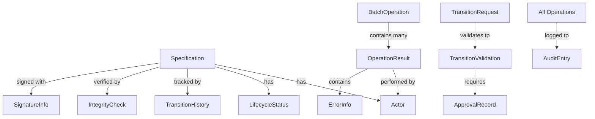

# Oracle CLI Unified Data Model

## Overview

This document defines the unified data model for Oracle CLI, providing consistent type definitions across all domain functions and system features. It resolves inconsistencies and establishes a single source of truth for shared concepts.

## Core Types

### 1. Specification Entity

The central entity representing any specification document in the system.

```yaml
Specification:
  # Identity
  path: string                    # Relative path from repository root
  id: string?                     # Optional ID (e.g., REQ-001, DF-023)
  
  # Metadata
  title: string
  description: string
  version: string
  
  # Lifecycle
  status: LifecycleStatus
  created_at: datetime
  last_updated: datetime
  created_by: Actor
  updated_by: Actor
  
  # Content
  type: SpecificationType         # requirements, domain_features, system_features, etc.
  tags: string[]
  keywords: string[]
  
  # Relationships
  dependencies: string[]          # Paths to dependent specifications
  implementations: string[]       # Paths to implementation files
  
  # Security
  signature_status: SignatureStatus?
  last_signed_at: datetime?
  last_signed_by: Actor?
```

### 2. Actor Identity

Unified representation of users performing operations.

```yaml
Actor:
  email: string                   # Primary identifier
  role: UserRole                  # Role in the system
  name: string?                   # Display name (optional)
  permissions: Permission[]       # Calculated based on role
```

### 3. Operation Result

Generic result type for all operations with consistent error handling.

```yaml
OperationResult<T>:
  success: boolean
  timestamp: datetime
  duration_ms: number
  actor: Actor
  
  # Success case
  data: T?                        # Operation-specific result data
  
  # Failure case
  error: ErrorInfo?
  warnings: Warning[]
  
  # Audit
  operation_id: string            # Unique operation identifier
  git_commit: string?             # Associated git commit if any
```

### 4. Error Information

Standardized error representation.

```yaml
ErrorInfo:
  code: ErrorCode                 # Enumerated error codes
  message: string                 # Human-readable message
  details: string?                # Technical details
  suggestion: string?             # Actionable suggestion
  related_paths: string[]         # Related file paths
```

## Enumerations

### Lifecycle Status

```yaml
LifecycleStatus:
  - draft
  - review
  - approved
  - implementing
  - implemented
  - verified
  - deprecated
```

### User Roles

```yaml
UserRole:
  - product_owner
  - domain_expert
  - technical_lead
  - architect
  - developer
  - qa_engineer
  - technical_director
  - security_officer
```

### Specification Types

```yaml
SpecificationType:
  - requirements
  - domain_features
  - system_features
  - system_design
  - components
```

### Signature Status

```yaml
SignatureStatus:
  - valid
  - invalid
  - missing
  - expired
  - revoked
```

### Error Codes

```yaml
ErrorCode:
  # File system errors (1xxx)
  - 1001: file_not_found
  - 1002: permission_denied
  - 1003: invalid_path
  
  # Validation errors (2xxx)
  - 2001: invalid_status_transition
  - 2002: missing_required_fields
  - 2003: invalid_yaml_format
  
  # Authorization errors (3xxx)
  - 3001: insufficient_permissions
  - 3002: invalid_role
  - 3003: expired_credentials
  
  # Integrity errors (4xxx)
  - 4001: signature_verification_failed
  - 4002: content_hash_mismatch
  - 4003: unauthorized_modification
  
  # Business logic errors (5xxx)
  - 5001: circular_dependency
  - 5002: missing_approval
  - 5003: policy_violation
```

## Domain-Specific Types

### Status Query Types

```yaml
StatusQueryResult:
  specification: Specification
  transition_history: TransitionHistory[]
  days_in_current_status: number
  related_specifications: RelatedSpec[]

TransitionHistory:
  from_status: LifecycleStatus
  to_status: LifecycleStatus
  transitioned_at: datetime
  transitioned_by: Actor
  reason: string?
  duration_in_previous: duration
  git_commit: string

BatchStatusResult:
  query_timestamp: datetime
  total_files: number
  specifications: StatusQueryResult[]
  summary_by_status: Map<LifecycleStatus, number>
  issues_found: Issue[]
```

### Lifecycle Management Types

```yaml
TransitionRequest:
  specification_path: string
  target_status: LifecycleStatus
  actor: Actor
  reason: string
  force_override: boolean
  approval_comments: string?

TransitionValidation:
  can_transition: boolean
  conditions_checked: ConditionCheck[]
  blocking_factors: BlockingFactor[]
  required_approvals: ApprovalRequirement[]
  warnings: Warning[]

ApprovalRecord:
  specification_path: string
  transition: string              # e.g., "review_to_approved"
  approver: Actor
  decision: ApprovalDecision      # approved, rejected, request_changes
  timestamp: datetime
  comments: string
  conditions_met: string[]
```

### Integrity Verification Types

```yaml
IntegrityCheck:
  specification_path: string
  check_timestamp: datetime
  
  content_integrity:
    status: IntegrityStatus       # valid, invalid, unknown
    content_hash: string
    expected_hash: string?
    hash_algorithm: string
    
  signature_integrity:
    status: SignatureStatus
    signature_info: SignatureInfo?
    
  change_detection:
    has_changes: boolean
    unauthorized_changes: Change[]
    last_authorized_change: datetime
    
  overall_result:
    trust_level: TrustLevel       # trusted, suspicious, compromised
    confidence_score: float       # 0.0 to 1.0
    risk_assessment: RiskLevel    # low, medium, high, critical

ChangeAnalysis:
  specification_path: string
  baseline_reference: string      # git commit, timestamp, or hash
  changes_detected: ChangeSet
  impact_assessment: ImpactAssessment
  recommendations: string[]
```

### Digital Signing Types

```yaml
SignatureInfo:
  signature_id: string
  specification_path: string
  
  cryptographic_data:
    algorithm: string             # HMAC-SHA256
    signature_value: string
    content_hash: string
    key_identifier: string
    
  signer_info:
    signer: Actor
    signed_at: datetime
    signing_reason: string
    
  validity_period:
    valid_from: datetime
    expires_at: datetime
    status: SignatureStatus
    
  metadata:
    specification_version: string
    specification_status: LifecycleStatus
    oracle_version: string

SigningOperation:
  operation_type: SigningOpType   # create, renew, revoke
  target_signature: string
  actor: Actor
  timestamp: datetime
  reason: string
  result: OperationResult<SignatureInfo>
```

## Batch Operation Types

Unified batch operation structure for all features.

```yaml
BatchOperation<T>:
  operation_id: string
  operation_type: string
  started_at: datetime
  completed_at: datetime
  
  input:
    target_pattern: string
    filters: Map<string, any>
    options: Map<string, any>
    
  progress:
    total_items: number
    processed_items: number
    successful_items: number
    failed_items: number
    
  results:
    successes: OperationResult<T>[]
    failures: OperationResult<T>[]
    
  performance:
    total_duration_ms: number
    average_item_duration_ms: number
    items_per_second: float
```

## History and Audit Types

Unified audit trail for all operations.

```yaml
AuditEntry:
  entry_id: string
  timestamp: datetime
  operation_type: string
  actor: Actor
  
  target:
    specification_path: string
    previous_state: any?
    new_state: any?
    
  details:
    description: string
    changes_made: string[]
    reason: string?
    
  system_info:
    oracle_version: string
    git_commit: string?
    ip_address: string?
```

## Type Relationships



## F# Type Mappings

```fsharp
// Core types
type SpecificationPath = SpecificationPath of string
type Actor = { Email: string; Role: UserRole; Name: string option }
type LifecycleStatus = Draft | Review | Approved | Implementing | Implemented | Verified | Deprecated

// Result types with railway-oriented programming
type Result<'T, 'Error> = 
    | Ok of 'T 
    | Error of 'Error

type OperationResult<'T> = {
    Success: bool
    Timestamp: DateTimeOffset
    DurationMs: int
    Actor: Actor
    Data: 'T option
    Error: ErrorInfo option
    Warnings: Warning list
    OperationId: Guid
}

// Domain-specific types using discriminated unions
type TransitionResult =
    | TransitionSuccess of Specification * TransitionHistory
    | TransitionBlocked of BlockingFactor list
    | TransitionError of ErrorInfo

type IntegrityResult =
    | Trusted of Specification * float  // confidence score
    | Suspicious of Specification * Issue list
    | Compromised of Specification * Change list
```

## Migration Strategy

### Phase 1: Core Types (Week 1)
- Implement base types (Specification, Actor, OperationResult)
- Create type converters for existing data

### Phase 2: Domain Integration (Week 2)
- Update each domain function to use unified types
- Maintain backward compatibility with adapters

### Phase 3: Testing and Validation (Week 3)
- Comprehensive testing with unified types
- Performance validation
- Migration of existing data

## Benefits

1. **Consistency**: Single definition for each concept across all features
2. **Type Safety**: Strong typing prevents runtime errors
3. **Maintainability**: Changes in one place affect all features
4. **Extensibility**: Easy to add new features with consistent types
5. **Documentation**: Self-documenting through type definitions
6. **Testability**: Unified types enable better property-based testing