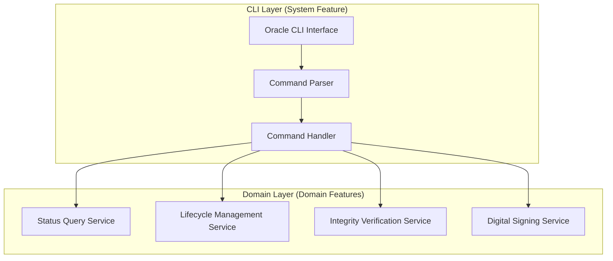

# Oracle CLI to Domain Function Mapping

## Overview

This document provides explicit mapping between Oracle CLI commands and their corresponding domain functions, ensuring clear separation of concerns and consistent implementation patterns.

## Architecture Overview



## Command to Domain Service Mapping

### 1. Status and Query Commands

| CLI Command | Domain Service | Method | Input Type | Output Type |
|-------------|----------------|---------|------------|-------------|
| `oracle status <path>` | StatusQueryService | `getSpecificationStatus` | `SpecificationPath` | `StatusQueryResult` |
| `oracle list [options]` | StatusQueryService | `listSpecifications` | `ListOptions` | `BatchStatusResult` |
| `oracle history <path>` | StatusQueryService | `getTransitionHistory` | `SpecificationPath` | `TransitionHistory[]` |

```fsharp
// CLI Command Handler
match command with
| Status path ->
    let request = { Path = path; IncludeHistory = false }
    statusService.GetSpecificationStatus(request)
    
| List options ->
    let request = {
        Directory = options.Directory
        StatusFilter = options.Status
        DateRange = options.DateRange
        OutputFormat = options.Format
    }
    statusService.ListSpecifications(request)
    
| History path ->
    let request = { Path = path; IncludeHistory = true }
    statusService.GetTransitionHistory(request)
```

### 2. Lifecycle Management Commands

| CLI Command | Domain Service | Method | Input Type | Output Type |
|-------------|----------------|---------|------------|-------------|
| `oracle transition <path> --to <status>` | LifecycleService | `executeTransition` | `TransitionRequest` | `OperationResult<TransitionResult>` |
| `oracle approve <path>` | LifecycleService | `quickApprove` | `ApprovalRequest` | `OperationResult<ApprovalRecord>` |
| `oracle check-transition <path> --to <status>` | LifecycleService | `validateTransition` | `TransitionRequest` | `TransitionValidation` |

```fsharp
// CLI to Domain Mapping
match command with
| Transition (path, targetStatus, options) ->
    let request = {
        SpecificationPath = path
        TargetStatus = targetStatus
        Actor = getCurrentActor()
        Reason = options.Reason
        ForceOverride = options.Force
    }
    lifecycleService.ExecuteTransition(request)
    
| Approve (path, options) ->
    let request = {
        SpecificationPath = path
        Approver = getCurrentActor()
        Comments = options.Comments
    }
    lifecycleService.QuickApprove(request)
```

### 3. Integrity and Verification Commands

| CLI Command | Domain Service | Method | Input Type | Output Type |
|-------------|----------------|---------|------------|-------------|
| `oracle verify <path>` | IntegrityService | `verifySpecification` | `VerificationRequest` | `OperationResult<IntegrityCheck>` |
| `oracle verify-all [options]` | IntegrityService | `batchVerify` | `BatchVerificationRequest` | `BatchOperation<IntegrityCheck>` |

```fsharp
// Verification Command Mapping
match command with
| Verify (path, options) ->
    let request = {
        SpecificationPath = path
        VerificationDepth = options.Depth
        IncludeSignature = options.CheckSignature
    }
    integrityService.VerifySpecification(request)
    
| VerifyAll options ->
    let request = {
        TargetPattern = options.Pattern
        ParallelProcessing = options.Parallel
        OutputFormat = options.Format
    }
    integrityService.BatchVerify(request)
```

### 4. Digital Signing Commands

| CLI Command | Domain Service | Method | Input Type | Output Type |
|-------------|----------------|---------|------------|-------------|
| `oracle sign <path>` | SigningService | `signSpecification` | `SigningRequest` | `OperationResult<SignatureInfo>` |
| `oracle signatures [options]` | SigningService | `listSignatures` | `SignatureListOptions` | `SignatureInfo[]` |
| `oracle resign <path>` | SigningService | `renewSignature` | `RenewalRequest` | `OperationResult<SignatureInfo>` |

```fsharp
// Signing Command Mapping
match command with
| Sign (path, options) ->
    let request = {
        SpecificationPath = path
        Signer = getCurrentActor()
        Reason = options.Reason
        ExpiresIn = options.Expiry
    }
    signingService.SignSpecification(request)
    
| Signatures options ->
    let request = {
        StatusFilter = options.Status
        SignerFilter = options.Signer
        IncludeExpired = options.ShowExpired
    }
    signingService.ListSignatures(request)
```

## Parameter Mapping Conventions

### 1. Common Parameter Mappings

| CLI Parameter | Domain Model Field | Type Conversion |
|---------------|-------------------|-----------------|
| `--format` | `OutputFormat` | String to Enum |
| `--since` | `DateRange.Start` | String to DateTime |
| `--until` | `DateRange.End` | String to DateTime |
| `--author` | `Actor.Email` | String validation |
| `--force` | `ForceOverride` | Flag to Boolean |
| `--json` | `OutputFormat.Json` | Flag to Enum |

### 2. Path Resolution

```fsharp
// Standardized path resolution
let resolvePath (input: string) : SpecificationPath =
    let path = 
        if Path.IsPathRooted(input) then
            Path.GetRelativePath(repositoryRoot, input)
        else
            input
    
    // Validate path exists and is YAML
    if not (File.Exists(path)) then
        raise (FileNotFoundException($"Specification not found: {path}"))
    
    if not (path.EndsWith(".yaml") || path.EndsWith(".yml")) then
        raise (InvalidOperationException($"Not a YAML file: {path}"))
    
    SpecificationPath path
```

### 3. Actor Resolution

```fsharp
// Get current actor from environment/config
let getCurrentActor() : Actor =
    let email = 
        Environment.GetEnvironmentVariable("ORACLE_USER_EMAIL")
        ?? GitConfig.GetUserEmail()
        ?? Config.DefaultSignerEmail
    
    let role = RoleService.GetUserRole(email)
    
    { Email = email; Role = role; Name = None }
```

## Service Composition Patterns

### 1. Cross-Service Operations

Some CLI commands require coordination between multiple domain services:

```fsharp
// Example: Sign command may need verification first
let handleSignCommand (path: SpecificationPath) (options: SignOptions) =
    async {
        // First verify integrity
        let! integrityResult = integrityService.VerifySpecification({
            SpecificationPath = path
            VerificationDepth = VerificationDepth.Full
        })
        
        match integrityResult with
        | Ok integrity when integrity.TrustLevel = Trusted ->
            // Proceed with signing
            return! signingService.SignSpecification({
                SpecificationPath = path
                Signer = getCurrentActor()
                Reason = options.Reason
            })
        | Ok integrity ->
            return Error $"Cannot sign untrusted specification: {integrity.TrustLevel}"
        | Error e ->
            return Error $"Verification failed: {e.Message}"
    }
```

### 2. Transaction Boundaries

```fsharp
// Ensure atomic operations across services
let executeTransitionWithSigning request =
    use transaction = new TransactionScope()
    
    try
        // Execute transition
        let transitionResult = lifecycleService.ExecuteTransition(request)
        
        // Auto-sign if moving to approved
        if request.TargetStatus = Approved then
            let signResult = signingService.SignSpecification({
                SpecificationPath = request.SpecificationPath
                Signer = request.Actor
                Reason = "Auto-signed on approval"
            })
            
            transaction.Complete()
            Ok (transitionResult, Some signResult)
        else
            transaction.Complete()
            Ok (transitionResult, None)
    with
    | ex ->
        Error $"Transaction failed: {ex.Message}"
```

## Error Mapping

### CLI Error Codes to Domain Errors

```fsharp
let mapDomainErrorToExitCode (error: ErrorInfo) : ExitCode =
    match error.Code with
    | FileNotFound -> ExitCode.FileNotFound
    | PermissionDenied -> ExitCode.PermissionDenied
    | InvalidStatusTransition 
    | MissingRequiredFields -> ExitCode.InvalidArguments
    | InsufficientPermissions
    | InvalidRole -> ExitCode.AuthorizationError
    | SignatureVerificationFailed
    | ContentHashMismatch -> ExitCode.IntegrityViolation
    | _ -> ExitCode.GeneralError
```

### Error Message Formatting

```fsharp
let formatDomainError (error: ErrorInfo) : string =
    let icon = 
        match error.Code / 1000 with
        | 1 -> "📁"  // File system errors
        | 2 -> "⚠️"   // Validation errors
        | 3 -> "🔒"  // Authorization errors
        | 4 -> "🛡️"   // Integrity errors
        | 5 -> "📋"  // Business logic errors
        | _ -> "❌"
        
    $"{icon} Error [{error.Code}]: {error.Message}\n" +
    (if error.Details.IsSome then $"   Details: {error.Details.Value}\n" else "") +
    (if error.Suggestion.IsSome then $"💡 Suggestion: {error.Suggestion.Value}\n" else "")
```

## Output Formatting

### Domain Model to CLI Output

```fsharp
// Transform domain results to CLI output
let formatStatusResult (result: StatusQueryResult) (format: OutputFormat) =
    match format with
    | Table ->
        TableFormatter.format [
            ("Path", result.Specification.Path)
            ("Status", result.Specification.Status.ToString())
            ("Updated", result.Specification.LastUpdated.ToString("yyyy-MM-dd HH:mm:ss"))
            ("By", result.Specification.UpdatedBy.Email)
            ("Version", result.Specification.Version)
        ]
    
    | Json ->
        JsonSerializer.Serialize(result, jsonOptions)
    
    | Csv ->
        CsvFormatter.format [
            result.Specification.Path
            result.Specification.Status.ToString()
            result.Specification.LastUpdated.ToString("o")
            result.Specification.UpdatedBy.Email
            result.Specification.Version
        ]
    
    | Yaml ->
        YamlSerializer.Serialize(result)
```

## Testing Strategy

### 1. Unit Testing CLI-Domain Mapping

```fsharp
[<Fact>]
let ``Status command maps correctly to domain service`` () =
    // Arrange
    let path = SpecificationPath "test.yaml"
    let mockService = Mock<IStatusQueryService>()
    let handler = CommandHandler(mockService.Object)
    
    // Act
    let result = handler.Execute(Status path)
    
    // Assert
    mockService.Verify(fun s -> 
        s.GetSpecificationStatus(It.Is<StatusRequest>(fun r -> 
            r.Path = path && not r.IncludeHistory
        )), Times.Once())
```

### 2. Integration Testing

```fsharp
[<Fact>]
let ``Full command execution integrates all layers`` () =
    // Arrange
    let testSpec = createTestSpecification()
    let cli = new OracleCli(testConfiguration)
    
    // Act
    let exitCode = cli.Execute([| "status"; testSpec.Path |])
    
    // Assert
    exitCode |> should equal ExitCode.Success
    capturedOutput |> should contain testSpec.Status.ToString()
```

## Performance Considerations

### 1. Service Caching

```fsharp
// Cache frequently accessed services
type CachedCommandHandler(serviceProvider: IServiceProvider) =
    let statusService = lazy(serviceProvider.GetService<IStatusQueryService>())
    let lifecycleService = lazy(serviceProvider.GetService<ILifecycleService>())
    let integrityService = lazy(serviceProvider.GetService<IIntegrityService>())
    let signingService = lazy(serviceProvider.GetService<ISigningService>())
    
    member _.Execute(command: OracleCommand) =
        match command with
        | Status _ | List _ | History _ -> 
            statusService.Value.Handle(command)
        | Transition _ | Approve _ | CheckTransition _ ->
            lifecycleService.Value.Handle(command)
        // etc.
```

### 2. Async Command Execution

```fsharp
// All domain services return async results
let executeCommandAsync (command: OracleCommand) = async {
    try
        let! result = 
            match command with
            | Status path -> statusService.GetSpecificationStatusAsync(path)
            | List options -> statusService.ListSpecificationsAsync(options)
            // etc.
        
        return formatResult result
    with
    | :? OperationCanceledException ->
        return Error "Operation cancelled by user"
    | ex ->
        return Error $"Unexpected error: {ex.Message}"
}
```

## Summary

This mapping document ensures:

1. **Clear Separation**: CLI concerns (parsing, formatting) are separated from domain logic
2. **Consistent Patterns**: All commands follow the same mapping patterns
3. **Type Safety**: Strong typing prevents runtime mapping errors
4. **Testability**: Each layer can be tested independently
5. **Maintainability**: Changes to CLI or domain can be made independently