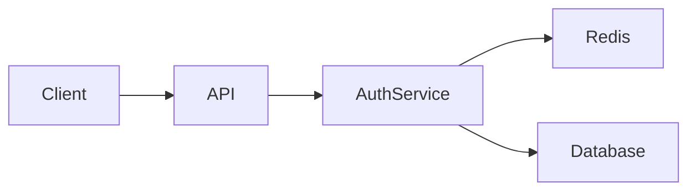

# Oracle Document Structure Design

## Overview
Oracle manages specifications in a 5-layer hierarchical structure, progressively refining from user needs to implementation details, with a clear separation between domain (business) and system (technical) features.

## Document Hierarchy

```
docs/specifications/
├── requirements/           # User Requirements
│   ├── user-management.md
│   ├── order-processing.md
│   └── reporting.md
│
├── domain-features/       # Business/Domain Features
│   ├── user-registration.md
│   ├── user-profile.md
│   ├── order-creation.md
│   ├── payment-processing.md
│   └── sales-report.md
│
├── system-features/       # Technical/System Features
│   ├── authentication.md
│   ├── authorization.md
│   ├── logging.md
│   ├── caching.md
│   └── api-gateway.md
│
├── system-design/         # System Design
│   ├── microservices-architecture.md
│   ├── security-infrastructure.md
│   └── data-pipeline.md
│
├── components/            # Component Design
│   ├── jwt-handler.md
│   ├── redis-cache.md
│   └── event-bus.md
│
└── index.yaml            # Master index with relationships
```

## Layer Definitions

### Requirements Layer
**Purpose**: Capture what users actually need
**Audience**: Product managers, stakeholders, developers
**Content**:
- User stories
- Business objectives
- Acceptance criteria
- Priority and impact

**Example**:
```markdown
---
id: user-authentication
title: User Authentication
category: security
priority: critical
stakeholder: product-team
---

# User Authentication Requirement

## User Story
As a user, I want to securely log into the system so that I can access my personal data.

## Acceptance Criteria
- Users can log in with email and password
- System remembers logged-in users
- Users can log out securely
- Failed login attempts are limited

## Business Value
- Protects user data
- Enables personalized features
- Compliance with security standards
```

### Domain Features Layer
**Purpose**: Define business/domain functionality that delivers user value
**Audience**: Product team, developers, QA
**Content**:
- Ubiquitous language definitions
- Business logic and rules
- User workflows
- Domain-specific requirements
- Business constraints

**Example**:
```markdown
---
id: user-registration
title: User Registration
implements: [user-management]
category: user-domain
type: domain-feature
---

# User Registration Feature

## Ubiquitous Language
- **Registrant**: A person attempting to create an account
- **Account**: A user's presence in the system with credentials and profile
- **Verification**: The process of confirming email ownership
- **Activation**: Changing account status from pending to active
- **Pending Account**: Account created but not yet verified
- **Active Account**: Fully verified and usable account

## Business Description
Allow new users to create accounts and access the system.

## Business Rules
- Unique email per account
- Age verification (18+)
- Terms acceptance required
- Email verification within 24 hours

## User Workflow
1. Registrant provides registration details
2. System validates business rules
3. Account created in pending state
4. Verification email sent
5. Registrant confirms email
6. Account activated
```

### System Features Layer
**Purpose**: Define technical capabilities that support domain features
**Audience**: Technical team, architects
**Content**:
- Technical requirements
- Cross-cutting concerns
- Infrastructure features
- Security and performance

**Example**:
```markdown
---
id: authentication
title: Authentication Service
supports: [user-registration, user-login]
category: security
type: system-feature
---

# Authentication Feature

## Technical Description
Provide secure authentication mechanism for all user-facing features.

## Technical Requirements
- JWT token generation
- Token expiration (15 min)
- Refresh token support
- Multi-factor authentication
- Session management

## Integration Points
- Used by: All domain features requiring user identity
- Dependencies: Redis for session storage
- API: RESTful endpoints for auth operations
```

### System Design Layer
**Purpose**: Technical architecture and design decisions
**Audience**: Senior developers, architects
**Content**:
- Architecture diagrams
- Technology choices
- Integration patterns
- Performance considerations

**Example**:
```markdown
---
id: authentication-architecture
title: Authentication Architecture
implements: [login-flow, password-reset]
category: security
technologies: [JWT, Redis, bcrypt]
---

# Authentication System Architecture

## Overview
JWT-based stateless authentication with Redis session store.

## Architecture


## Design Decisions
- JWT for stateless auth
- Redis for session blacklist
- bcrypt for password hashing
- 15-minute token expiry

## Security Considerations
- HTTPS only
- Secure cookie flags
- CSRF protection
```

### Components Layer
**Purpose**: Detailed implementation specifications
**Audience**: Developers
**Content**:
- API contracts
- Data models
- Implementation details
- Code examples

**Example**:
```markdown
---
id: jwt-handler
title: JWT Handler Component
implements: [authentication-architecture]
category: security
language: python
---

# JWT Handler Component

## API Contract
```python
class JWTHandler:
    def generate_token(user_id: str, expires_in: int = 900) -> str:
        """Generate JWT token for user"""
        
    def verify_token(token: str) -> Optional[dict]:
        """Verify and decode JWT token"""
        
    def revoke_token(token: str) -> None:
        """Add token to blacklist"""
```

## Data Models
```python
@dataclass
class TokenPayload:
    user_id: str
    issued_at: datetime
    expires_at: datetime
    roles: List[str]
```

## Implementation Requirements
- Use PyJWT library
- Store secret in environment
- Implement token refresh logic
- Log all token operations
```

## Document Relationships

### Traceability Matrix
```yaml
# index.yaml
relationships:
  user-authentication:
    features: [login-flow, password-reset]
    tests: [test-authentication, test-password]
    
  login-flow:
    requirements: [user-authentication]
    system_designs: [authentication-architecture]
    components: [jwt-handler, session-manager]
    
  authentication-architecture:
    features: [login-flow, password-reset]
    components: [jwt-handler, email-service, session-manager]
    
  jwt-handler:
    system_design: authentication-architecture
    source_files: ["src/auth/jwt_handler.py"]
    tests: ["tests/test_jwt_handler.py"]
```

## Metadata Standards

### Common Metadata Fields
```yaml
# Required fields
id: "user-authentication"   # Unique identifier (kebab-case)
title: "User Authentication" # Human-readable title
category: "security"        # Classification

# Optional fields
priority: "critical"        # critical/high/medium/low
status: "approved"         # draft/review/approved/deprecated
tags: ["auth", "security"] # Searchable tags

# Relationship fields
implements: ["user-auth"]   # What this implements
depends_on: ["email-service"] # Dependencies
related: ["session-mgmt"]  # Related documents
```

## Benefits of This Structure

1. **Clear Traceability**: Requirements → Domain/System Features → System Design → Components
2. **Separation of Concerns**: Business logic vs technical infrastructure
3. **Progressive Refinement**: Each layer adds more detail
4. **Multiple Audiences**: Different layers for different stakeholders
5. **Flexible Navigation**: Can enter at any layer
6. **Complete Coverage**: From user needs to implementation
7. **Reusability**: System features can support multiple domain features

## AI Search Strategy

The AI can navigate this structure intelligently:
- Start from any layer based on query type
- Follow relationships up or down
- Gather context from multiple layers
- Provide comprehensive answers with full traceability