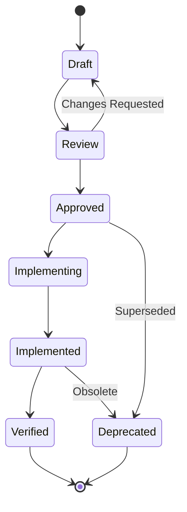

# Specification Operation Flow

## Overview

This document defines the operational workflows for creating, validating, implementing, and maintaining specifications in the Oracle system.

## Specification Lifecycle

### 1. Lifecycle States



### 2. State Definitions

**Note**: For detailed transition conditions and blocking rules, see [ID and Lifecycle Details](id-and-lifecycle-details.md).

```yaml
states:
  Draft:
    description: "Initial creation, work in progress"
    allowed_changes: "All changes allowed"
    next_states: ["Review"]
    
  Review:
    description: "Under review by stakeholders"
    allowed_changes: "Minor clarifications only"
    next_states: ["Draft", "Approved"]
    
  Approved:
    description: "Approved for implementation"
    allowed_changes: "None without new review"
    next_states: ["Implementing", "Deprecated"]
    
  Implementing:
    description: "Being implemented in code"
    allowed_changes: "Clarifications only"
    next_states: ["Implemented", "Deprecated"]
    
  Implemented:
    description: "Code complete"
    allowed_changes: "None"
    next_states: ["Verified", "Deprecated"]
    
  Verified:
    description: "Implementation verified against spec"
    allowed_changes: "None"
    next_states: ["Deprecated"]
    
  Deprecated:
    description: "No longer in use"
    allowed_changes: "None"
    next_states: []
```

## Operational Workflows

### 1. Specification Creation Flow

```yaml
workflow: create_specification
steps:
  1_identify_need:
    actor: "Product Owner / Developer"
    action: "Identify missing specification"
    output: "Requirement description"
    
  2_determine_layer:
    actor: "Developer"
    action: "Determine appropriate layer"
    tool: "oracle suggest-layer --description '...'"
    output: "Target layer and suggested file name"
    
  3_create_draft:
    actor: "Developer"
    action: "Create specification file"
    tool: "oracle new-spec --layer {layer} --name {name}"
    output: "Draft specification with ID"
    
  4_define_types:
    actor: "Developer"
    action: "Define types and constraints"
    validation: "oracle validate-types {file}"
    
  5_add_examples:
    actor: "Developer"
    action: "Add test cases and examples"
    validation: "oracle verify-examples {file}"
    
  6_link_references:
    actor: "Developer"
    action: "Link to related specifications"
    tool: "oracle link-specs {file} --to {other-specs}"
```

### 2. Review and Approval Flow

```yaml
workflow: review_specification
steps:
  1_submit_review:
    actor: "Developer"
    action: "Submit for review"
    tool: "oracle submit-review {spec-id}"
    notification: "Stakeholders notified"
    
  2_automated_checks:
    actor: "Oracle System"
    checks:
      - "Syntax validation"
      - "Type consistency"
      - "Reference integrity"
      - "Naming conventions"
      - "Test coverage"
    
  3_stakeholder_review:
    actor: "Domain Expert / Architect"
    actions:
      - "Verify business logic"
      - "Check completeness"
      - "Validate examples"
    
  4_approval_decision:
    actor: "Technical Lead"
    outcomes:
      approve: "Move to Approved state"
      reject: "Back to Draft with comments"
```

### 3. Implementation Flow

```yaml
workflow: implement_specification
steps:
  1_claim_implementation:
    actor: "Developer"
    action: "Claim specification for implementation"
    tool: "oracle claim {spec-id}"
    state_change: "Approved → Implementing"
    
  2_generate_stubs:
    actor: "Developer"
    action: "Generate implementation stubs"
    tool: "oracle generate-stubs {spec-id} --lang python"
    output: "Type definitions and function signatures"
    
  3_implement_code:
    actor: "Developer"
    action: "Write implementation"
    constraints:
      - "Must match specification types"
      - "Must handle all error cases"
      - "Must pass generated tests"
    
  4_continuous_validation:
    actor: "Oracle System"
    action: "Real-time validation during coding"
    tool: "oracle watch {implementation-file}"
    feedback: "Immediate deviation warnings"
    
  5_mark_complete:
    actor: "Developer"
    action: "Mark implementation complete"
    tool: "oracle complete {spec-id} --impl {file}"
    validation: "All specification requirements met"
```

### 4. Verification Flow

```yaml
workflow: verify_implementation
steps:
  1_automated_verification:
    actor: "CI/CD Pipeline"
    actions:
      - "Run specification tests"
      - "Check type compliance"
      - "Verify error handling"
      - "Validate naming conventions"
    tool: "oracle verify-all"
    
  2_coverage_analysis:
    actor: "Oracle System"
    action: "Analyze specification coverage"
    metrics:
      - "Type coverage: 100%"
      - "Error case coverage: 100%"
      - "Example coverage: 100%"
    
  3_manual_review:
    actor: "Technical Reviewer"
    actions:
      - "Code quality review"
      - "Performance considerations"
      - "Security assessment"
    
  4_verification_result:
    outcomes:
      pass: "Mark as Verified"
      fail: "Back to Implementing with report"
```

## Daily Operations

### 1. Developer Workflow

```bash
# Morning: Check assigned specifications
oracle my-specs --status implementing

# During development: Real-time validation
oracle watch src/feature.py --spec SF-001

# Before commit: Verify compliance
oracle pre-commit --verify-specs

# After implementation: Update status
oracle complete SF-001 --impl src/feature.py
```

### 2. Reviewer Workflow

```bash
# Check pending reviews
oracle pending-reviews

# Review specification
oracle review DF-023 --with-examples

# Approve or request changes
oracle approve DF-023
oracle request-changes DF-023 --comment "Missing error cases"
```

### 3. Architect Workflow

```bash
# Monitor system compliance
oracle compliance-dashboard

# Find specification gaps
oracle find-gaps --in src/

# Check specification health
oracle health-check specifications/
```

## Automation Integration

### 1. Git Hooks

```bash
# .git/hooks/pre-commit
#!/bin/bash
oracle pre-commit --verify-specs --check-naming

# .git/hooks/commit-msg
#!/bin/bash
oracle check-commit-msg --require-spec-id
```

### 2. CI/CD Pipeline

```yaml
# .github/workflows/oracle.yml
name: Oracle Verification
on: [push, pull_request]

jobs:
  verify:
    steps:
      - name: Validate Specifications
        run: oracle validate-all specifications/
        
      - name: Verify Implementations
        run: oracle verify-all --coverage
        
      - name: Check Naming Conventions
        run: oracle check-naming --all
        
      - name: Generate Compliance Report
        run: oracle report --format html
```

### 3. IDE Integration

```yaml
# VSCode settings.json
{
  "oracle.realTimeValidation": true,
  "oracle.showSpecHints": true,
  "oracle.autoGenerateTypes": true,
  "oracle.warnOnDeviation": true
}
```

## Conflict Resolution

### 1. Specification Conflicts

```yaml
conflict_types:
  naming_conflict:
    description: "Two specs define same term differently"
    resolution: "Domain expert decides canonical definition"
    
  type_conflict:
    description: "Incompatible type definitions"
    resolution: "Refactor to shared base type"
    
  requirement_conflict:
    description: "Contradictory requirements"
    resolution: "Product owner prioritizes"
```

### 2. Resolution Process

```bash
# Detect conflicts
oracle find-conflicts

# Propose resolution
oracle resolve-conflict --between SF-001 SF-002

# Apply resolution
oracle apply-resolution --conflict-id CNF-001
```

## Maintenance Operations

### 1. Specification Updates

```yaml
update_rules:
  backward_compatible:
    - "Adding optional fields"
    - "Loosening constraints"
    - "Adding new error codes"
    
  breaking_changes:
    - "Removing fields"
    - "Tightening constraints"
    - "Changing types"
    - "Removing error codes"
```

### 2. Deprecation Process

```bash
# Mark specification as deprecated
oracle deprecate DF-001 --replaced-by DF-050

# Find usages of deprecated spec
oracle find-usages DF-001

# Migrate implementations
oracle migrate --from DF-001 --to DF-050
```

### 3. Cleanup Operations

```bash
# Find orphaned specifications
oracle find-orphans

# Archive old specifications
oracle archive --older-than 1year --status deprecated

# Cleanup unreferenced types
oracle cleanup-types --dry-run
```

## Monitoring and Metrics

### 1. Key Metrics

```yaml
metrics:
  specification_coverage:
    description: "Percentage of code covered by specs"
    target: "> 95%"
    
  implementation_compliance:
    description: "Specs with compliant implementations"
    target: "100%"
    
  specification_age:
    description: "Average age of active specs"
    target: "< 6 months"
    
  review_time:
    description: "Average time from draft to approved"
    target: "< 3 days"
```

### 2. Dashboard Views

```bash
# Overall health
oracle dashboard

# Specification metrics
oracle metrics --period 30d

# Team performance
oracle team-stats --group-by developer
```

## Best Practices

### 1. Specification Writing

- Start with clear requirements
- Define types before behavior
- Include both success and failure cases
- Use domain language consistently
- Keep specifications focused and cohesive

### 2. Implementation

- Generate stubs from specifications
- Use continuous validation during development
- Implement all error cases
- Maintain specification traceability
- Update specifications if requirements change

### 3. Review Process

- Automate what can be automated
- Focus human review on business logic
- Require examples for all behaviors
- Verify ubiquitous language usage
- Check for specification completeness

## Emergency Procedures

### 1. Specification Rollback

```bash
# Rollback to previous version
oracle rollback SF-001 --to-version {git-sha}

# Notify affected implementations
oracle notify-implementations SF-001 --message "Specification rolled back"
```

### 2. Emergency Override

```bash
# Temporary override for production issue
oracle override SF-001 --reason "Production hotfix" --expires 24h

# Must be resolved within expiry time
```

## Quick Reference Card

### Common Commands
```bash
oracle new-spec              # Create new specification
oracle validate              # Validate specification
oracle verify                # Verify implementation
oracle watch                 # Real-time monitoring
oracle my-specs             # View assigned specs
oracle review               # Review specification
oracle complete             # Mark implementation done
oracle dashboard            # View system health
```

### State Transitions
- Draft → Review → Approved → Implementing → Implemented → Verified
- Any state → Deprecated (with reason)