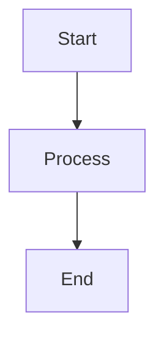
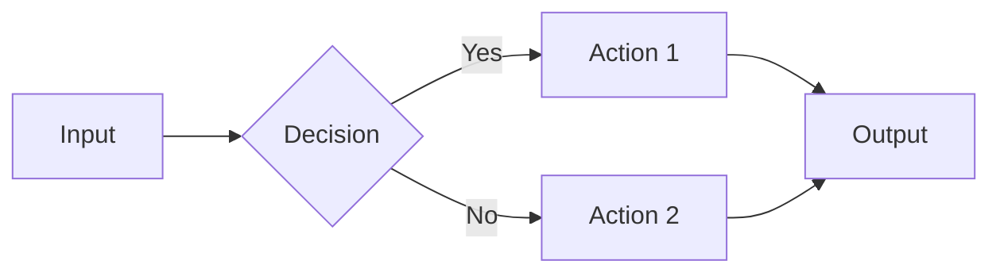
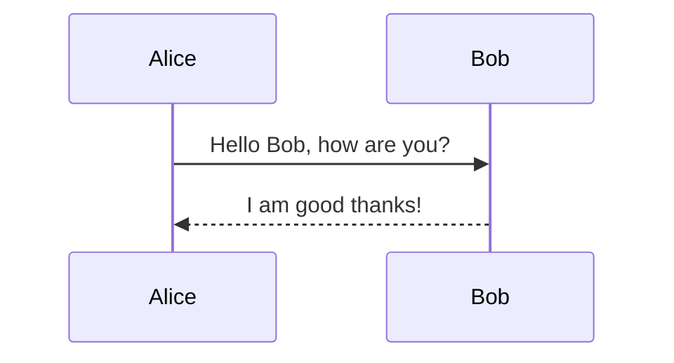

# Mermaid Test

This is a test document to verify Mermaid diagram rendering.

## Simple Graph

```mermaid
graph TD
    A[Start] --> B[Process]
    B --> C[End]
```

## Flowchart

```mermaid
flowchart LR
    A[Input] --> B{Decision}
    B -->|Yes| C[Action 1]
    B -->|No| D[Action 2]
    C --> E[Output]
    D --> E
```

## Sequence Diagram

```mermaid
sequenceDiagram
    Alice->>Bob: Hello Bob, how are you?
    Bob-->>Alice: I am good thanks!
```

This should render as diagrams, not code blocks.